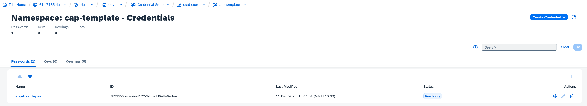
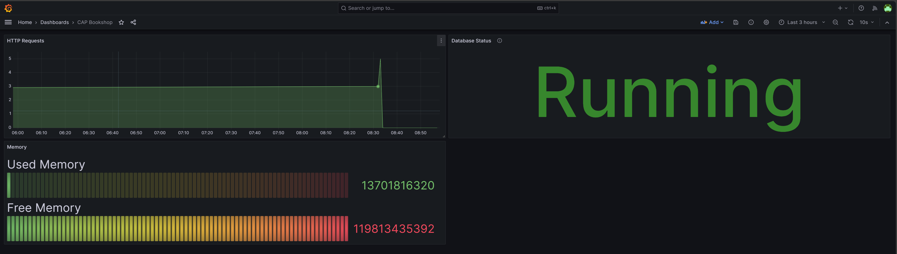

# Observability App
A simple CAP App to be used to demontrate how to capture low level app metrics and then via a batch periodically aggregate metrics data exposed via a metrics service.

The metrics data is then configured to be consumed in a grafana dashboard.

Incorporates:
- Security
- Observability


[](https://img.shields.io/github/issues/katansapdevelop/cap-observability-app)

## Observability
Implements a custom ping and health check.  Implements logging use the CDS log service, which natively can be used to ingest into Kibana

Concepts taken from the Azure Cloud Design Pattern, [Monitor Instance Health](https://learn.microsoft.com/en-us/azure/architecture/patterns/health-endpoint-monitoring)

## Authentication
Credentials are created and read from the credential service.  For this app use the namespace "cap-template" and name "app-health-pwd".



### Hybrid Testing
Note when running hybrid testing, you need to bind the credential service local via ``` cds bind -2 cred-store:cred-store-key```.  If you have not created a key, you will need to do do so via ```cf create-service-key cred-store cred-store-key```

**I also deleted the 'customer-service' prefix in the .csdrc-private.json file that was added**

### Grafana Cloud



### Batch Job
A batch job has been setup in the [server.js](/srv/server.js) file. It runs every 60 seconds to aggergate data from the http request logs to determine the total requests in that period.

## Helmet
[Helmet](https://helmetjs.github.io/) helps secure Express apps by setting HTTP response headers and/or removing them

## Testing 


### Chai/Jest
Added support for tests via Chai/Jest
```
npm run test
```


### .http
Some simple tests have also been setup in tests.http folder to support local testing


