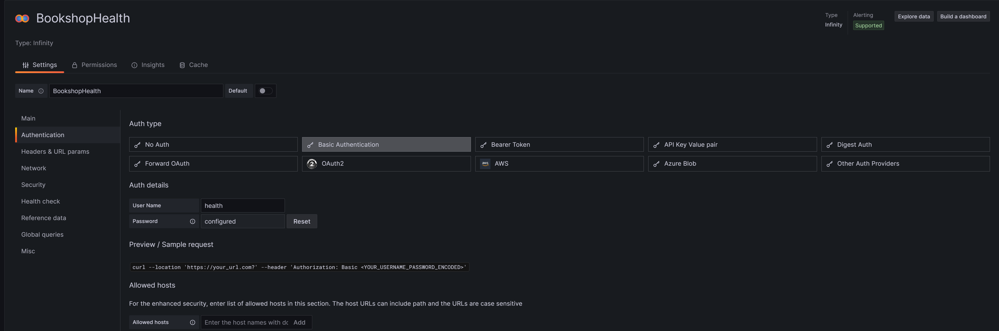

# Grafana Cloud Setup

## Install Infinity Plugin

## Create a Data Source for Infinity (Bookshop Health)
This endpoint is secured via Basic Authentication.  

## Create a Data Source for Infinity (Bookshop Metrics)
This endpoint is secured via OAuth (Client Credentials).  

