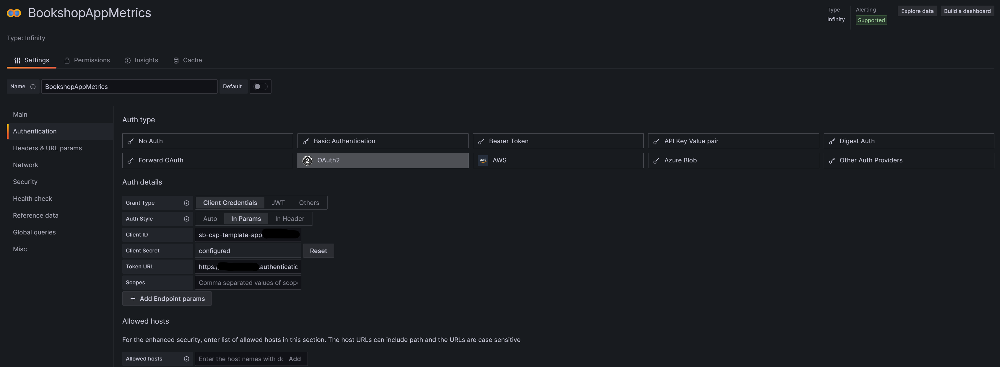

# Grafana Cloud Setup

## Setup an Account
Setup a new account for Grafana Cloud at [https://grafana.com/](https://grafana.com/auth/sign-in)

## Install Infinity Plugin
Follow the steps [here](https://grafana.com/docs/grafana/latest/administration/plugin-management/#install-a-plugin) to install the infinity plug in into Grafana Cloud.

## Create a Data Source for Infinity (Bookshop Health)
This endpoint is secured via Basic Authentication using the credentials you saved in the credential store.  

## Create a Data Source for Infinity (Bookshop Metrics)
This endpoint is secured via OAuth2 (Client Credentials).  

This blog on [OAuth2 Client Credentials](https://community.sap.com/t5/technology-blogs-by-sap/using-postman-for-api-testing-with-xsuaa/ba-p/13442516) by Marius Obert was pretty handy for me 

## Create your Dashboard
Create a new dashboard & [import the JSON dashboard file](https://grafana.com/docs/grafana/latest/dashboards/build-dashboards/import-dashboards). The model can be found [here](grafanamodel.json)

